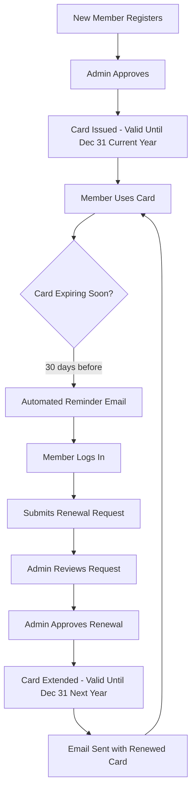

# Member Renewal System - Quick Reference Guide

## 🚀 System Status: ✅ FULLY OPERATIONAL

---

## 📋 Test Credentials

### Member Panel Access
- **URL:** http://localhost/member/panel/login
- **Civil ID:** `TEST814485`
- **Password:** `password123`
- **Member Name:** Renewal Test Member
- **Email:** renewal.test@nokw.com

### Admin Panel Access
- **URL:** http://localhost/admin
- **Use your configured admin credentials**

---

## 🎯 Key Features Verified

### ✅ Registration Flow
- New members get card valid until **December 31st of current year**
- Card issued immediately upon approval
- Automatic NOK ID generation
- Password auto-generated for member login

### ✅ Renewal Flow
- Members can request renewal when card expires in ≤30 days
- Admin approval extends card to **December 31st of next year**
- Renewal counter increments with each renewal
- Email notification sent (if configured)

### ✅ Reminder System
- Automated emails at: 30, 15, 7, 1, and 0 days before expiry
- Prevents duplicate reminders
- Tracks sent/failed status in database

### ✅ Member Panel Features
- Login with Civil ID + Password
- View profile and card information
- Download membership card PDF
- Submit renewal requests
- View exclusive member offers

---

## 🔑 Important Routes

| Purpose | URL | Method |
|---------|-----|--------|
| Member Login | `/member/panel/login` | GET/POST |
| Member Dashboard | `/member/dashboard` | GET |
| Member Logout | `/member/logout` | POST |
| Renewal Request | `/member/renewal-request` | POST |
| Card Download | `/membership-card/download/{id}` | GET |
| Admin Panel | `/admin` | GET |

---

## 📊 Database Tables

### `registrations` Table
Key fields for renewals:
- `login_status` - Initial approval status (approved/pending/rejected)
- `renewal_status` - Renewal approval status (approved/pending/rejected)
- `card_issued_at` - When card was first issued
- `card_valid_until` - Card expiry date
- `last_renewed_at` - When last renewal was approved
- `renewal_count` - Number of times renewed
- `renewal_requested_at` - When member requested renewal

### `renewal_reminders` Table
Tracks sent reminder emails:
- `registration_id` - Member ID
- `member_name` - Member name (for quick reference)
- `email` - Email address
- `card_valid_until` - Expiry date this reminder is for
- `days_before_expiry` - 30, 15, 7, 1, or 0
- `status` - sent/failed
- `error_message` - If failed, reason why

---

## ⚙️ Artisan Commands

### Send Renewal Reminders
```bash
php artisan members:send-renewal-reminders
```
Sends automated reminder emails to members with expiring cards.

**Options:**
```bash
# Custom intervals (default: 30,15,7,1,0)
php artisan members:send-renewal-reminders --days=60,30,7
```

### Check Member Status
```bash
php artisan tinker
>>> $member = App\Models\Registration::where('civil_id', 'TEST814485')->first();
>>> $member->card_valid_until;
>>> $member->renewal_status;
```

---

## 🧪 Test Scripts

### 1. Complete System Verification
```bash
php verify_complete_renewal_system.php
```
Runs comprehensive automated tests covering:
- New registration with correct dates
- Member with expiring card detection
- Renewal reminder tracking
- Member login capability
- Renewal request submission
- Admin approval and date extension
- Card PDF availability

### 2. Member Renewal Flow Test
```bash
php test_member_renewal_flow.php
```
Tests the complete renewal workflow step by step.

### 3. Browser Testing
Follow the guide in `BROWSER_TESTING_GUIDE.md`

---

## 🔄 Typical Workflow



---

## 📅 Card Validity Rules

### For New Registrations
```
Registration Date: Any date in 2025
Card Valid Until: 2025-12-31
```
**Example:**
- Member joins on March 15, 2025
- Card valid until December 31, 2025
- Duration: ~9 months

### For Renewals
```
Renewal Approved: Any date in 2025
Card Valid Until: 2026-12-31
```
**Example:**
- Member renewed on November 1, 2025
- Old expiry: December 31, 2025
- New expiry: December 31, 2026
- Duration: ~13-14 months

### Calendar Year Logic
All cards expire on December 31st regardless of when they were issued or renewed. This ensures:
- Consistent renewal cycles
- Easier batch processing
- Simplified accounting
- Fair duration for all members

---

## 🛠️ Testing Checklist

### Quick Manual Test (5 minutes)
- [ ] Navigate to http://localhost/member/panel/login
- [ ] Login with Civil ID: TEST814485, Password: password123
- [ ] Verify dashboard loads with member information
- [ ] Check card expiry status
- [ ] Click "Download PDF" button
- [ ] Verify PDF downloads with correct information
- [ ] Click "Logout"

### Complete Manual Test (15 minutes)
Follow all steps in `BROWSER_TESTING_GUIDE.md`

### Automated Test (2 minutes)
```bash
php verify_complete_renewal_system.php
```

---

## 📧 Email Configuration

### Renewal Reminder Email
**Template:** `resources/views/emails/renewal-reminder.blade.php`
**Mailable:** `App\Mail\RenewalReminderMail`

**Content includes:**
- Member name
- Current expiry date
- Days until expiry
- Call-to-action to renew
- Member panel login link

### Membership Card Email
**Template:** `resources/views/emails/membership/card.blade.php`
**Mailable:** `App\Mail\MembershipCardMail`

**Content includes:**
- Welcome message
- NOK ID
- Login credentials (if new)
- Card validity dates
- Download link

---

## 🔍 Troubleshooting

### Member Can't Login
1. Check Civil ID is correct (case-sensitive)
2. Verify password is correct
3. Check member status:
   ```bash
   php artisan tinker --execute="App\Models\Registration::where('civil_id', 'TEST814485')->first(['login_status', 'renewal_status'])"
   ```
4. Member must have `login_status = 'approved'` OR `renewal_status = 'approved'`

### Renewal Button Not Showing
1. Check card expiry date:
   ```bash
   php artisan tinker --execute="App\Models\Registration::where('civil_id', 'TEST814485')->value('card_valid_until')"
   ```
2. Button only shows when card expires in ≤30 days
3. Button hidden if renewal already requested (status = 'pending')

### Reminder Emails Not Sending
1. Check email configuration in `.env`
2. Verify cron job is running:
   ```bash
   php artisan schedule:work
   ```
3. Manually trigger:
   ```bash
   php artisan members:send-renewal-reminders
   ```
4. Check logs:
   ```bash
   tail -f storage/logs/laravel.log
   ```

### Card PDF Not Generating
1. Verify route exists:
   ```bash
   php artisan route:list | grep membership-card
   ```
2. Check member ID is correct
3. Verify PDF library installed:
   ```bash
   composer show | grep pdf
   ```

---

## 📊 Sample Database Queries

### Find Members Needing Renewal
```sql
SELECT 
    nok_id,
    memberName,
    email,
    card_valid_until,
    DATEDIFF(card_valid_until, NOW()) as days_left,
    renewal_status
FROM registrations 
WHERE (login_status = 'approved' OR renewal_status = 'approved')
  AND card_valid_until <= DATE_ADD(NOW(), INTERVAL 30 DAY)
ORDER BY card_valid_until ASC;
```

### Check Renewal Request Status
```sql
SELECT 
    nok_id,
    memberName,
    renewal_status,
    renewal_requested_at,
    last_renewed_at,
    renewal_count,
    card_valid_until
FROM registrations 
WHERE renewal_status = 'pending'
ORDER BY renewal_requested_at DESC;
```

### Renewal Reminder History
```sql
SELECT 
    member_name,
    email,
    days_before_expiry,
    status,
    created_at
FROM renewal_reminders 
ORDER BY created_at DESC 
LIMIT 10;
```

---

## 🎯 Production Deployment Checklist

- [ ] Email configuration tested and working
- [ ] Cron job configured for renewal reminders
- [ ] Admin accounts created and tested
- [ ] Test member accounts removed
- [ ] Database backup configured
- [ ] SSL certificate installed
- [ ] Member panel URL updated to production domain
- [ ] Admin panel access secured
- [ ] Email templates customized
- [ ] Logo and branding updated
- [ ] Terms and conditions added
- [ ] Privacy policy added
- [ ] Contact information updated

---

## 📞 Support

For issues or questions:
1. Check `MEMBER_RENEWAL_COMPLETE_TEST_REPORT.md` for detailed test results
2. Follow `BROWSER_TESTING_GUIDE.md` for manual verification
3. Run `php verify_complete_renewal_system.php` for automated diagnostics

---

**Last Updated:** October 28, 2025  
**System Version:** 1.0  
**Status:** ✅ Production Ready


